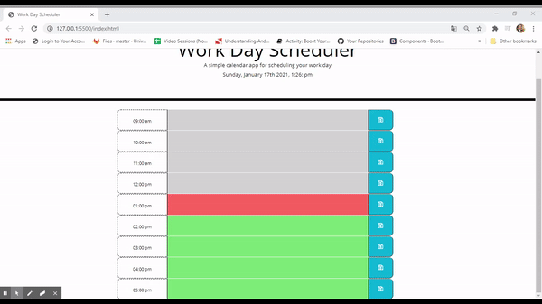

# Work_Day_Scheduler_SEF
-----------------------------------------------------------------------------------------------------------------------
Table of content :

1. The purpose
2. The method
3. HTML file
4. CSS file
5. Bootsrap framework
6. JQuery file
7. Demonstration
8. URLs 

-----------------------------------------------------------------------------------------------------------------------

## 1. The purpose :

The main purpose of this project is to create a simple calendar application that allows a user to save events for each hour of the day by modifying starter code.

-----------------------------------------------------------------------------------------------------------------------

## 2. The method : 

    This website is created using the following languages, libraries and software.

    * HTML files : index.html.
    * CSS file : style.css
    * JQuery file: script.js
    * Bootstrap
    * moment.js library
    * JSON
    * VS Code
    * Github
   

-----------------------------------------------------------------------------------------------------------------------

## 3. HTML file : 
    
    This file is created according to the standards.

    * Using sementics
    * Using consistently indentation and spacing
    * Using links to link the HTML file to other files (CSS an JQuery files)
    * Using external links to link the HTML file to Bootstrap and JQuery
    * Commenting the code

-----------------------------------------------------------------------------------------------------------------------

## 4. CSS file : 

This file is used to personalise the styles by creating new classes and id.

    The main CSS properties used in this website are :
    
    * Font : font-size, font-family 
    * Border : border-top, border-top-width, border-style
    * Padding
    * Height
    * Bottom
    * color : color, background-color

-----------------------------------------------------------------------------------------------------------------------

## 5. Bootsrap framework : 

This open-source framework is used to style the website and make it reponsive. 

    The main Bootsrap components used in this website are :

    * Grid-system : container, rows and columns (.container, .row, .col)
    * Responsive grid: .col-xs .col-md
    * Icons : .far .fa-save .fa-lg

-----------------------------------------------------------------------------------------------------------------------

## 6. JQuery file : 

This file is used to create a dynamic website using functions to create a simple calendar.

    The main JQuery properties and methods used in this website are :
    
    * Functions : creating new functions [CurrentDay(), displayTask(), saveTask(), displaystorage()]
    * HTML DOM : .on() Method , .each() Method, localStorage.setItem() Method localStorage.getItem() Method, .text() Method, .val() Method, .attr() Method, .append() Method,
    .siblings Method
    * Conditions : if statements
    * JSON Methods : .stringify() Method, .parse Method
    * moment.js library : moment().format()

-----------------------------------------------------------------------------------------------------------------------

## 7. Demonstration :

-----------------------------------------------------------------------------------------------------------------------

## 8. URLs

* The URL of the deployed application : https://saadiaelf.github.io/Work_Day_Scheduler_SEF/

* The URL of the GitHub repository: https://github.com/SaadiaELF/Work_Day_Scheduler_SEF.git

-----------------------------------------------------------------------------------------------------------------------
